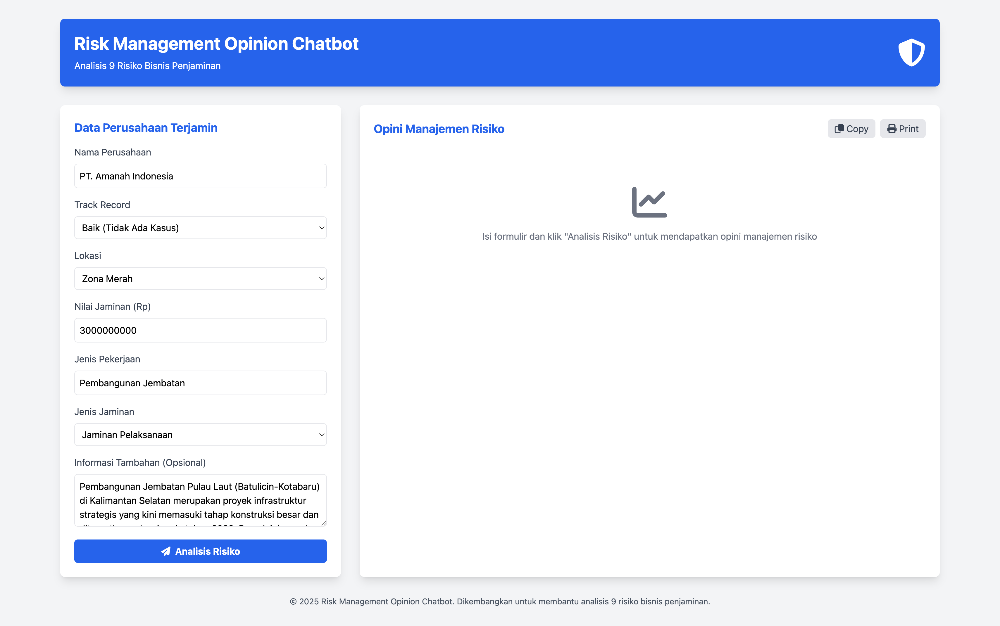
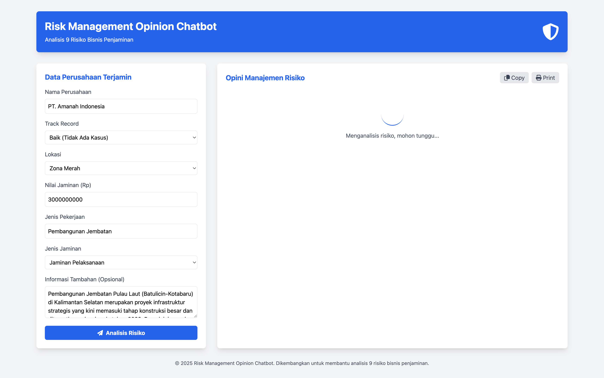
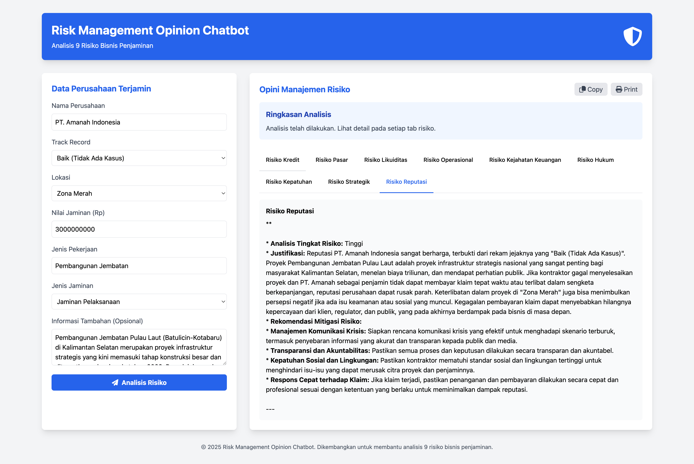

# ManRisk Bot

Aplikasi chatbot untuk manajemen risiko bisnis Penjaminan menggunakan Google Generative AI.

## About the Application

ManRisk Bot ini adalah aplikasi chatbot yang dirancang untuk membantu dalam manajemen risiko pada bisnis Penjaminan. Aplikasi ini memanfaatkan Google Generative AI untuk menganalisis dan memberikan rekomendasi terkait risiko berdasarkan input pengguna. Melalui antarmuka web yang sederhana, pengguna dapat memasukkan deskripsi risiko dan menerima analisis mendalam serta saran mitigasi. Bot ini memberikan 9 risiko utama yang sering dihadapi dalam bisnis Penjaminan, termasuk Risiko Kredit, Risiko Operasional, Risiko Pasar, Risiko Likuiditas, Risiko Hukum dan Kepatuhan, Risiko Reputasi, Risiko Strategis, Risiko Teknologi Informasi, dan Risiko Bencana Alam. Dengan fitur-fitur canggih dan integrasi AI, ManRisk Bot bertujuan untuk meningkatkan efisiensi dan efektivitas dalam pengelolaan risiko bisnis.

### Key Features

- Fitur analisis risiko otomatis
- Rekomendasi mitigasi risiko berbasis AI
- Antarmuka pengguna yang intuitif

## Prerequisites

- Node.js (v14 or higher recommended)
- npm or yarn

## Installation

1. Clone the repository:
    ```bash
    git clone https://github.com/ibnusensei/manrisk-bot.git
    cd manrisk-bot
    ```

2. Install dependencies:
    ```bash
    npm install
    # or
    yarn install
    ```

3. Configure the application:
    - Salin `.env.example` file ke `.env`
    - Ubah `GEMINI_API_KEY` di file `.env` dengan API key Google Generative AI Anda.
    ```bash
    cp .env.example .env
    ```

## Running the Application

### Development Mode

```bash
npm run dev
# or
yarn dev
```

### Production Mode

```bash
npm start
# or
yarn start
```

## Configuration Options

| Variable | Description | Default |
|----------|-------------|---------|
| `PORT` | The port on which the application runs | 3000 |
| [Add more variables as needed] | | |

## Usage Examples

1. Buka browser dan akses `http://localhost:3000`.
2. Masukkan deskripsi risiko yang ingin dianalisis.
3. Klik tombol "Analyze Risk" untuk mendapatkan analisis dan rekomendasi.

## Screenshots


